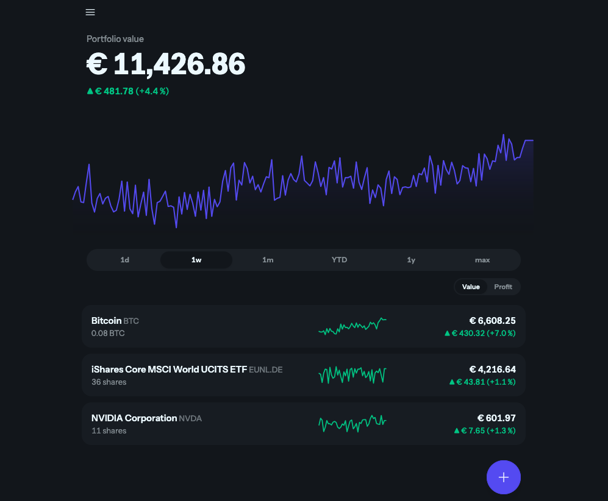

# Folio

**A self-hosted portfolio tracker for crypto, stocks and ETFs.** You enter your
transactions; Folio fetches prices and exchange rates in the background and shows
what your portfolio is worth over time. Everything stays on your server.

**What it isn't:** no ads, no tracking, no sign-up, no premium tier, no news feed,
no social features, no broker linking. One portfolio, one chart, one list of
holdings — and nothing else competing for your attention.



## What it does

- **Manual transactions** — buy or sell, with asset, date and time, quantity,
  price per unit, fee and currency. Edit or delete any of them later.
- **Asset lookup** — autocomplete across your own assets, CoinGecko and Yahoo
  Finance, with a manual-ticker fallback for when remote search is unavailable.
- **Value and profit over time** — an interactive chart over 1d, 1w, 1m, YTD, 1y
  or max, with a Value ↔ Profit toggle.
- **Per-asset holdings** — quantity, current value, change over the selected
  window and a sparkline; click through for that asset's transaction history.
- **Currency switch** — view everything in EUR or USD, converted per timestamp
  through daily ECB rates.
- **CSV export/import** — back up every transaction, or move them to another
  tool. Each row carries the asset's own identity (ISIN + market, or symbol
  for crypto), so a file is self-sufficient and re-importing it is a safe
  no-op — nothing about Folio locks your data in.
- **Honest numbers** — cost basis is locked in the portfolio's base currency at
  execution time, and money paid in during a window is not counted as profit.
- **Live updates** — background price and FX refreshes push straight into the
  open page. No reloading.
- **Light, dark or system theme.**

## Status

v0.1, and built for a single person on a single machine. One portfolio, one
bootstrapped user, and no login flow yet — the session simply acts as the `Admin`
user. There is no dividend tracking and no JSON API.

## Quick start

Requires Elixir 1.20 / OTP 28 (see `.tool-versions`) and Docker for PostgreSQL.

```sh
docker compose up -d postgresql   # Postgres 16 on :5432
mix setup                         # deps, database, seeds, assets
mix phx.server                    # http://localhost:4000
```

`mix setup` seeds a sample portfolio — Bitcoin, a EUR-quoted MSCI World ETF and
NVIDIA in USD — with two years of transactions and locally generated price and FX
history. A fresh checkout therefore opens on a populated dashboard without any
external API being touched.

## Configuration

Environment variables are read in `config/runtime.exs`, and nowhere else.

| Variable | Default | Purpose |
|---|---|---|
| `ADMIN_PASSWORD` | `admin` | Password for the bootstrapped user, hashed once on first boot |
| `COINGECKO_API_KEY` | — | Optional free demo key; raises the crypto rate limit to 100 req/min |
| `OPEN_FIGI_KEY` | — | Optional free key for ISIN/WKN lookup; raises the keyless 25 req/min limit (legacy name `OPENFIGI_API_KEY` still read) |
| `DATABASE_URL` | — | Required in production |
| `SECRET_KEY_BASE` | — | Required in production |
| `PHX_HOST` | `localhost` | Hostname or IP you reach Folio at — must match the address bar |
| `PORT` | `4000` | Port Folio listens on |
| `SCHEME` | `http` | Set to `https` when a proxy in front terminates TLS |
| `URL_PORT` | `PORT`, or `443` when `SCHEME=https` | Public port used in generated URLs |
| `CHECK_ORIGIN` | `PHX_HOST` | Comma-separated allowed websocket origins, or `false` to disable the check |

## Deployment

`docs/deployment/` holds a Docker Compose example built around the published image
(`ghcr.io/emischorr/folio`) and a Postgres service.

Folio serves **plain HTTP** and never terminates TLS itself. Reach it directly at
`http://<host>:4000`, or put your own reverse proxy in front — the proxy owns the
certificate, the `http` → `https` redirect and any HSTS header. When you do, set
`SCHEME=https` so links and the session cookie match what the browser sees.

Set `PHX_HOST` to the host or IP you actually type into the address bar. Phoenix
checks the websocket origin against it, so a mismatch leaves the page rendered but
dead — no live updates. Use `CHECK_ORIGIN` when Folio is reachable under more than
one name.

> **Upgrading from an earlier build?** It sent an HSTS header, so your browser may
> still force `https://` for that hostname. Clear the pin via
> `chrome://net-internals/#hsts` (or the Firefox equivalent) before plain HTTP loads.

## Architecture: market data

Assets carry only **general, vendor-neutral identity** — securities are
ISIN + MIC (ISO 10383 venue code) + the exchange-local ticker; crypto is a
symbol. No provider id, suffix, or source name is ever stored on an asset.
`Folio.MarketData.Markets` is the hardcoded registry of supported venues
(name, country, default currency, timezone, trading hours); adding a market is
a code change with a test.

The data problem is split into three concerns, each a behaviour with its own
chain of interchangeable sources (plus a small FX behaviour):

- **Lookup** (`Folio.MarketData.Sources.Lookup`) — user input (ISIN, WKN,
  ticker, free text) → candidate listings. Used only when adding an asset.
- **History** (`Folio.MarketData.Sources.History`) — daily closes over a date
  range. Used by backfill and the nightly close.
- **Quote** (`Folio.MarketData.Sources.Quote`) — the latest (possibly delayed)
  price. Used by the periodic refresh; an optional batch callback lets a
  source answer one provider call for many listings.

`Folio.MarketData.Chain` walks the configured sources in order — the chains
live in `config :folio, :market_data_sources`, per kind (`security` /
`crypto`) and concern. For each source it checks the source's own
`supports?/1` coverage declaration (skip silently), then its token bucket
(`Folio.MarketData.RateLimiter`, budgets in `config :folio, :rate_limits` —
an empty bucket skips the source without calling it), then calls it: the
first non-empty success wins; empty results, failures and rate limits fall
through to the next source. Every attempt is recorded per source and outcome
as telemetry, counted by `Folio.MarketData.SourceStats`
(`Folio.MarketData.source_stats/0` in iex), so a silently broken source
becomes visible.

**Mapping lives in the source.** Yahoo builds `EUNL.DE` from ticker + a
per-MIC suffix table inside `Sources.Yahoo`; OpenFIGI maps its Bloomberg
exchange codes to MICs inside `Sources.OpenFigi`; CoinGecko resolves
symbol → coin id itself (cached, with pinned overrides in its config).
The rare listing whose vendor naming breaks the rule is fixed with an
override map in that source's config, never on the asset.

**Degrade, don't zero.** If every source fails, the last known price stays
and its age is shown ("as of …"); backfills run chunked at low Oban priority
so they can never starve the refresh of budget; a rate-limited job snoozes
with a capped doubling backoff and is cancelled at the limit.

### Adding a source

1. Implement `Folio.MarketData.Sources.Source` (`supports?/1`) plus the
   concern behaviours it serves, in `lib/folio/market_data/sources/`. Build
   requests with `Sources.HTTP.base/1` and record fixtures under
   `test/support/api_responses/`.
2. Register it in the right chain(s) in `config :folio, :market_data_sources`
   and give it a budget in `config :folio, :rate_limits` (keyed by the
   module's underscored basename, e.g. `:my_source`).
3. Keep any provider-id mapping, suffix table or override map inside the
   module or its own config key.

A boundary test enforces that nothing outside `lib/folio/market_data/`
touches sources, chain, limiter or cache — the rest of the app sees only the
`Folio.MarketData` API plus the pure `Markets`/`Listing` modules.

## Architecture: import/export

Folio never locks your data in. `Folio.ImportExport` exports every
transaction as CSV — close to the `transactions` table, with the asset's
vendor-neutral identity (ISIN + market, or symbol for crypto) denormalized
onto each row, so a file is self-sufficient even on an instance that has
never seen that asset before. Re-importing an exported file is a safe no-op:
`source`/`external_id` give each row a stable natural key, so already-present
rows are skipped rather than duplicated.

Import is a pluggable behaviour, `Folio.ImportExport.Format`, precisely so a
second file shape doesn't touch anything else. `Folio.ImportExport.Formats.FolioCsv`
is the only implementation today, both for export and for reading its own
file back in.

### Adding an import format

1. Implement `Folio.ImportExport.Format` (`parse/1`) in a new module under
   `lib/folio/import_export/formats/`, mapping the file's own columns onto
   the canonical field set documented on the behaviour.
2. Pass the module explicitly to `Folio.ImportExport.import_csv/3` (it
   defaults to `Formats.FolioCsv`) — asset resolution, deduping and the
   batched price/FX backfill are all handled by `Folio.ImportExport` and
   `Folio.Portfolios` and need no changes.

## External data sources

All endpoint notes verified 2026-08-27.

| Data | Source | Limits and caveats |
|---|---|---|
| Securities lookup (ISIN, WKN) | [OpenFIGI](https://www.openfigi.com/api) — `Sources.OpenFigi` | Keyless: 25 req/min per IP; `OPEN_FIGI_KEY` raises that. Maps identifier → per-venue tickers; never returns an identifier, so WKN hits carry no ISIN (typed in by hand, checksum-validated). Bloomberg exchange codes are mapped to MICs in-source. |
| Securities quotes (EU) | Tradegate — `Sources.Tradegate` | Keyless, ISIN-native JSON at `www.tradegatebsx.com/refresh.php` (`tradegate.de` 301s there). EUR only. The price is Tradegate's own venue price, used as a delayed proxy for German-retail and Euronext EUR listings. Reports `last: 0` pre-open, which the source treats as "no quote". |
| Securities quotes (XETR/XFRA) | Börse Frankfurt — `Sources.BoerseFrankfurt` | Keyless JSON at `api.boerse-frankfurt.de/v1/data/quote_box/single?isin=…&mic=…`; the MD5 trace headers older community docs describe are no longer required for quotes. The `price_history` and chart endpoints answer an empty `{}` regardless of headers, so **history is not implemented** for it. |
| Securities history + fallback quotes/search | Yahoo Finance, unofficial — `Sources.Yahoo` | Keyless but needs a browser User-Agent. The most fragile provider and the scarcest budget — always last in every chain. The EU consent/crumb handshake is not implemented; if Yahoo starts demanding it, this source fails and the chain degrades. Symbols are built from ticker + per-MIC suffix, with per-ISIN overrides in config. |
| Crypto lookup, history, quotes | [CoinGecko](https://www.coingecko.com/en/api) — `Sources.CoinGecko` | Keyless: ~5–15 req/min, history capped at ~365 days; a free demo key raises this to 100/min. Symbol → coin id resolved in-source via `/search`, cached a day, pinned by `id_overrides` for ambiguous symbols. |
| FX rates (daily, EUR pivot) | [Frankfurter](https://frankfurter.dev) / ECB — `Sources.Frankfurter` | Keyless, business days only — weekend gaps are expected and resolved by "latest rate at or before" lookups. |

Dead ends, kept here so they are not retried:

- **Stooq** (verified again 2026-08-27): every endpoint serves a JavaScript
  proof-of-work challenge and cannot be used server-side.
- **Portfolio Report** (portfolio-report.net, verified 2026-08-27): the domain
  no longer resolves; the community securities service is discontinued.

### Searching for European instruments

Three things make Yahoo search awkward for UCITS ETFs and ETCs, and the Yahoo
source works around each:

- Yahoo types many German and Stuttgart listings as `MUTUALFUND` rather than `ETF`,
  so the source accepts that type and maps it to `:etf`. Excluding it hides whole
  exchanges — EUWAX Gold II has no other listing.
- A full official name (`… UCITS ETF (Acc)`) often scores zero. When a search comes
  back empty the source retries once with the noise words and parentheticals
  stripped, and once with the first four words.
- An ISIN goes to OpenFIGI first; only when it knows nothing does the chain fall
  through to a Yahoo search. Every WKN goes through OpenFIGI (`ID_WERTPAPIER`).

Yahoo's search endpoint is rate-limited per IP and returns 429 well before you
would expect. The chart endpoint used for prices is a separate bucket, but not an
immune one — it answers 429 too, which stops price fetching rather than search.
`Folio.MarketData.Cache` therefore fronts every lookup (10 minutes for hits, a
60-second negative cache for rate limits), rate-limit responses are never retried
at the HTTP layer, and the asset picker says so explicitly rather than showing an
empty dropdown when search is throttled. Background jobs back off exponentially on
a 429 and cancel once `Folio.MarketData.Backoff`'s snooze limit is reached, so a
throttled provider can never leave a job spinning indefinitely.

Candidate currencies default to the venue's currency from the Markets registry
(a search must not spend chart-endpoint budget per candidate); the rare listing
quoted in a non-default currency is fixed by editing the currency on the form.

**No provider returns an ISIN for a ticker.** Yahoo omits it everywhere and OpenFIGI
only maps in the identifier → ticker direction, so a security's ISIN is stored when
it was the search query and is otherwise typed in by hand (checksum-validated) —
creating a security requires it, since ISIN + MIC is the canonical identity.
Securities migrated from the earlier vendor-identity schema may lack parts of their
identity; they show an "unresolved" badge and a repair form on the asset page, and
are skipped by the refresh until repaired.

## Development

```sh
mix test        # tests; creates and migrates the test database first
mix precommit   # compile --warnings-as-errors, unused deps, format, credo, test
mix ecto.reset  # drop, create, migrate, reseed
```

Tests stub the HTTP layer with `Req.Test` against recorded fixtures, so no test
ever touches the network.

## Built with

- **Phoenix 1.8** and **LiveView** on Bandit, backed by **PostgreSQL**, with
  **Oban** for background price and FX jobs.
- **Tailwind v4** and daisyUI — and **no npm**: there is no `package.json` and no
  `node_modules`. Assets are built by the `tailwind` and `esbuild` Mix tasks.
- Charts use TradingView's [lightweight-charts](https://github.com/tradingview/lightweight-charts)
  (Apache-2.0), vendored in `assets/vendor/`. Sparklines are server-rendered SVG.
- Every monetary value is a `Decimal` end to end — JSON is decoded with
  `floats: :decimals` so floating-point values never enter the system.

## License

MIT — see [LICENSE](LICENSE).
